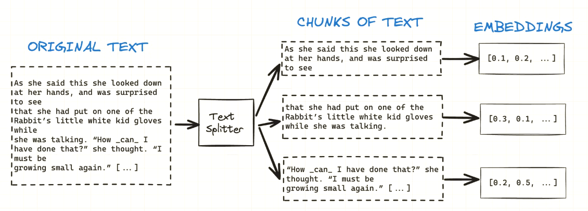
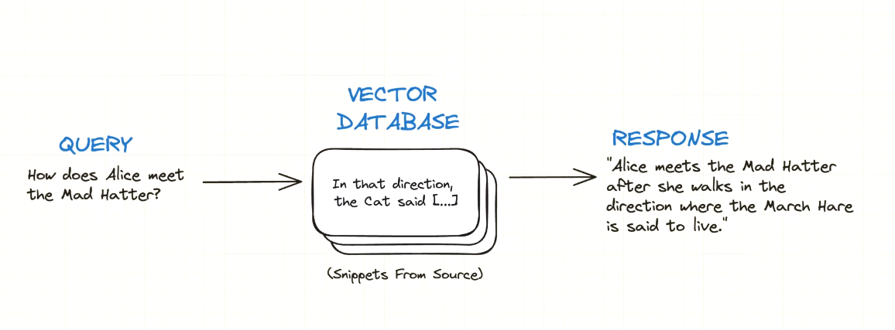

# LLM RAG App

In this project, I build a local RAG (Retrieval Augmented Generation) pipeline that processes PDF files and allows users to query information from these files using Large Language Models.

Retrieval-Augmented Generation is an advanced natural language processing (NLP) technique that combines the strengths of retrieval-based techniques and generation-based models to improve the quality and relevance of text generation tasks. These techniques involve searching a large corpus of documents to find the most relevant pieces of information based on a given query. They excel at providing factual and contextually relevant information quickly. 

Generational models (such as LLMs) create new text based on a given input, often using deep learning techniques such as transformers. They are capable of creating coherent and contextually rich text but might sometimes generate less than factual information.

## Project structure

Quite simply, we have our original data source which is the text contained in the PDFs we input. The data is split up into smaller chunks and transformed into embeddings using the 'nomic-embed-text' model within Ollama. These embeddings are essentially vectors and are stored within a vector database such as Chroma. Here you can search by nearest neighbors as opposed to substrings like in a typical database.

When an input query is submitted, it is also transformed into a vector embedding and we fetch the most relevant entries from the database (based on similarity search). This is used for the final response to the user.
